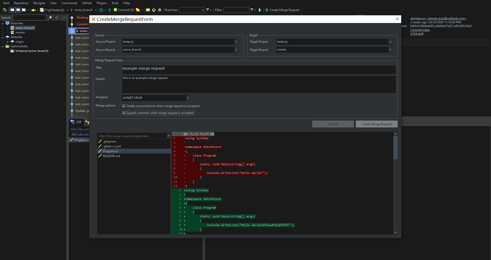
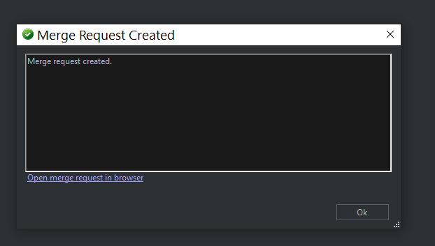

# GitLab Plugin for GitExtensions 

A GitLab Plugin for GitExtension. you can create merge request from GitExtensions.

Plugin can be installed using [GitExtensions.PluginManager](https://github.com/gitextensions/gitextensions.pluginmanager). 

